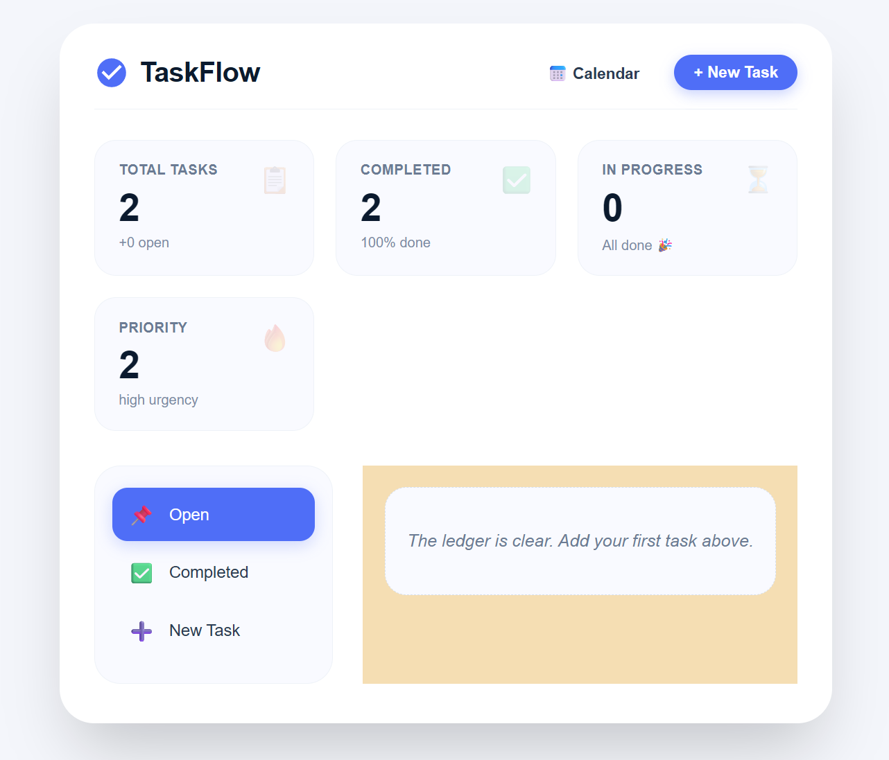

# 🚀 TaskFlow Pro – Full-Stack Task Management System

TaskFlow Pro is a modern full-stack task management application built using **React.js** and **Django REST Framework**. The application enables users to efficiently create, update, organize, and manage daily tasks through a clean, responsive, and user-friendly interface.

---

# 📸 Application Preview

<p align="center">
  
</p>

---

# ✨ Features

- ✅ Create new tasks
- ✏️ Edit existing tasks
- 🗑️ Delete tasks
- ✅ Mark tasks as Completed or Pending
- 🎯 Priority Management (Low, Medium, High)
- 📊 Dashboard with task statistics
- 📱 Fully Responsive User Interface
- ⚡ REST API integration
- 🎨 Modern and Clean UI Design

---

# 🛠 Tech Stack

### Frontend
- React.js
- Axios
- HTML5
- CSS3
- JavaScript (ES6)

### Backend
- Django
- Django REST Framework
- SQLite

### Tools & Technologies
- Git
- GitHub
- VS Code

---

# 📂 Project Structure

```text
Task-management/
│
├── backend/
│   ├── backend/
│   ├── todo/
│   └── manage.py
│
├── frontend/
│   ├── public/
│   ├── src/
│   └── package.json
│
├── assets/
│   └── dashboard.png
│
├── README.md
└── .gitignore
```

---

# 🚀 Installation

## Clone Repository

```bash
git clone https://github.com/kavilanrj-cmd/Task-management.git
cd Task-management
```

---

## Backend Setup

```bash
cd backend

pip install -r requirements.txt

python manage.py migrate

python manage.py runserver
```

Backend Server

```
http://127.0.0.1:8000
```

---

## Frontend Setup

```bash
cd frontend

npm install

npm start
```

Frontend Server

```
http://localhost:3000
```

---

# 📌 API Endpoints

| Method | Endpoint | Description |
|----------|------------------|-------------------------|
| GET | `/api/task/` | Get all tasks |
| POST | `/api/task/` | Create a task |
| GET | `/api/task/<id>/` | Get a task |
| PUT | `/api/task/<id>/` | Update a task |
| DELETE | `/api/task/<id>/` | Delete a task |

---

# 🎯 Key Functionalities

- Task Creation
- Task Editing
- Task Deletion
- Task Completion Tracking
- Task Priority Management
- Responsive Dashboard
- REST API Communication
- Dynamic State Management using React Hooks

---

# 🔮 Future Improvements

- 🔐 JWT Authentication
- 👤 User Login & Registration
- 📅 Due Date Management
- 🏷 Categories
- 🌙 Dark Mode
- 🔔 Notifications
- 📊 Charts & Analytics
- 📤 Export Tasks to PDF/CSV
- ☁️ Cloud Deployment
- 🤖 AI Task Suggestions

---

# 💻 Screenshots

### Dashboard


---

# 👨‍💻 Author

**Kavilan R J**

GitHub: https://github.com/kavilanrj-cmd

LinkedIn: *(Add your LinkedIn profile here)*

---

# ⭐ Support

If you found this project useful, consider giving it a ⭐ on GitHub.

---

## 📄 License

This project is licensed under the MIT License.